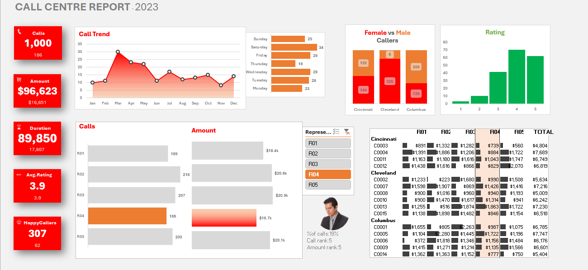

# Call Centre Performance Dashboard | Microsoft Excel
Interactive Microsoft Excel dashboard analyzing call centre performance, customer satisfaction, revenue, call trends, and representative-level operational insights.

## 📑 Table of Contents

- [📖 Project Overview](#-project-overview)
- [🎯 Business Problem](#-business-problem)
- [🎯 Project Objectives](#-project-objectives)
- [🛠️ Tools & Technologies](#️-tools--technologies)
- [🧹 Data Preparation & Transformation](#-data-preparation--transformation)
- [📊 Dashboard Preview](#-dashboard-preview)
- [⭐ Key Dashboard Features](#-key-dashboard-features)
- [📈 KPI Summary](#-kpi-summary)
- [💡 Key Insights](#-key-insights)
- [💼 Business Value](#-business-value)
- [🧠 Skills Demonstrated](#-skills-demonstrated)
- [🔗 Interactive Dashboard](#-interactive-dashboard)
- [👩‍💻 About the Author](#-about-the-author)

## 📖 Project Overview

The Call Centre Performance Dashboard is an interactive Microsoft Excel dashboard developed to analyze and monitor call centre operational performance using 2023 call centre data.

The project involved cleaning and transforming customer and representative data, validating data accuracy, standardizing formats, and resolving inconsistencies to improve data quality and support reliable analysis.

The dashboard combines KPI reporting, trend analysis, representative performance, customer demographics, call ratings, and city-level insights to provide a consolidated view of call centre operations and support data-driven decision-making.

## 🎯 Business Problem

Call centre data contains valuable information about customer interactions, representative performance, call activity, revenue, and customer satisfaction. However, analyzing raw operational data across multiple dimensions can make it difficult to identify performance trends and monitor key metrics efficiently.

The objective of this project was to transform the available call centre data into an interactive and easy-to-understand dashboard that enables users to:

- Monitor key call centre performance indicators
- Track call volume and revenue trends
- Analyze representative-level performance
- Understand customer demographics and rating patterns
- Compare performance across different cities and time periods
- Identify trends that can support operational monitoring and data-driven decision-making

## 🎯 Project Objectives

The key objectives of this project were to:

- Clean and transform raw call centre data to improve data quality and consistency
- Validate customer and representative data for accurate analysis
- Develop an interactive dashboard to monitor key operational performance indicators
- Analyze call volume, revenue, call duration, customer satisfaction, and happy caller percentage
- Evaluate representative-level performance across key metrics
- Identify trends in call activity across different time periods
- Analyze customer demographics, including gender and city-level distribution
- Examine customer rating patterns to understand satisfaction levels
- Use interactive filters and visualizations to enable dynamic exploration of performance data
- Present actionable insights through clear and intuitive data visualizations

## 🛠️ Tools & Technologies

- **Microsoft Excel** — Data analysis, dashboard development, and reporting
- **Power Pivot** — Data modeling and relationship management
- **Pivot Tables** — Data aggregation and performance analysis
- **Slicers** — Interactive filtering and dynamic data exploration
- **Interactive Charts** — Visual analysis of trends and performance metrics
- **Conditional Formatting** — Highlighting performance patterns and key values
- **Data Cleaning & Transformation** — Data validation, standardization, and preparation for analysis

## 🧹 Data Preparation & Transformation

The data preparation process focused on improving the quality and consistency of the call centre dataset before analysis and dashboard development.

Key data preparation activities included:

- Validating customer and representative data for accuracy and consistency
- Reviewing data for inconsistencies and potential data quality issues
- Standardizing data formats to support reliable analysis
- Cleaning and transforming data for use in Pivot Tables and Power Pivot
- Organizing data to enable analysis across representatives, cities, gender, ratings, and time periods
- Preparing structured data for KPI calculations and interactive dashboard visualizations

## 📊 Dashboard Preview

The dashboard provides an interactive overview of call centre performance, combining key performance indicators, trend analysis, customer insights, and representative-level performance metrics in a single view.

## ⭐ Key Dashboard Features

### 📌 KPI Monitoring

The dashboard provides a consolidated view of key call centre performance indicators, including:

- 📞 **Total Calls** — Measures overall call activity
- 💰 **Total Amount** — Tracks the financial value associated with call centre activity
- ⏱️ **Average Call Duration** — Monitors the average time spent handling calls
- ⭐ **Average Customer Rating** — Tracks overall customer satisfaction through ratings
- 😊 **Happy Callers %** — Measures the percentage of customers classified as happy callers

### 📈 Call Trend Analysis

- Analyzes call activity across different months and time periods
- Helps identify changes and patterns in call volume over time

### 📅 Day-wise Call Analysis

- Examines call distribution across different days
- Supports identification of periods with higher or lower call activity

### 👥 Customer Demographic Analysis

- Analyzes call distribution by gender
- Provides insights into customer activity across different demographic groups

### ⭐ Customer Rating Analysis

- Visualizes the distribution of customer ratings
- Helps monitor customer satisfaction patterns

### 👤 Representative Performance Analysis

- Compares representatives based on call volume
- Analyzes representative-level amount / revenue
- Enables performance comparison across individual representatives

### 🌍 City-level Analysis

- Provides insights into call activity across different cities
- Supports geographical analysis of call centre operations

### 🎛️ Interactive Filtering

- Uses slicers to dynamically filter dashboard information
- Enables focused analysis by representative and other available dimensions

## 📈 KPI Summary

The dashboard provides a high-level overview of call centre performance through five key performance indicators:

| KPI | Purpose |
|---|---|
| 📞 **Total Calls** | Measures overall call activity |
| 💰 **Total Amount** | Tracks the total financial amount associated with call centre activity |
| ⏱️ **Average Call Duration** | Measures the average duration of customer calls |
| ⭐ **Average Customer Rating** | Indicates the overall level of customer satisfaction based on ratings |
| 😊 **Happy Callers %** | Measures the proportion of callers classified as happy customers |

These KPIs provide a quick snapshot of operational performance and allow users to monitor key metrics alongside detailed trend and representative-level analysis.

## 💡 Key Insights

The dashboard enables users to explore call centre performance and identify meaningful patterns across operational and customer-related metrics.

Key analytical areas include:

- 📞 Monitoring overall call volume to understand call centre activity
- 📈 Identifying monthly and day-wise patterns in call activity
- 💰 Evaluating amount / revenue distribution across representatives
- 👤 Comparing representative-level performance based on call volume and financial metrics
- ⭐ Examining customer rating distribution to understand satisfaction patterns
- 😊 Monitoring happy caller percentage as an indicator of customer experience
- 👥 Analyzing call activity across different gender groups
- 🌍 Comparing call activity across cities to identify geographical patterns
- 🎛️ Using interactive filtering to explore performance from different perspectives

These insights help provide a consolidated view of operational performance and customer experience, supporting data-driven monitoring and decision-making.

## 💼 Business Value

The dashboard provides a centralized view of call centre performance and helps transform operational data into meaningful business insights.

It can support:

- 📊 Faster monitoring of key operational performance indicators
- 👤 Identification of representative-level performance patterns
- 📈 Improved visibility into call volume and activity trends
- 😊 Better understanding of customer satisfaction and happy caller metrics
- 🌍 Comparison of performance across different cities and customer segments
- 🎯 More efficient performance tracking through interactive filtering
- 💡 Data-driven decision-making by presenting complex information in a clear and accessible format

By consolidating multiple performance metrics into an interactive dashboard, the solution helps users efficiently explore operational trends and identify areas that may require further attention.

## 🧠 Skills Demonstrated

Through this project, I demonstrated the following skills:

- 📊 Data Analysis and Exploratory Analysis
- 🧹 Data Cleaning and Data Validation
- 🔄 Data Transformation and Preparation
- 📈 Data Visualization and Dashboard Development
- 🧮 KPI Design and Performance Reporting
- 🗄️ Power Pivot and Data Modeling
- 📋 Pivot Tables and Interactive Reporting
- 🎛️ Slicers and Dynamic Data Exploration
- 🎨 Dashboard Design and Visual Communication
- 💡 Business Insight Generation
- 📑 Operational Performance Analysis
- 📊 Data-driven Decision-making

## 🔗 Interactive Dashboard

Explore the interactive Call Centre Performance Dashboard through the view-only Excel workbook:

👉 **[View Interactive Dashboard](https://1drv.ms/x/c/8b64395c4ef8384b/IQCgtYgHCDpsTbnMeuNfVmpMAflZkxUhk_CCvk4sIVlsATk?e=t82Gjr
)**

> 🔒 The shared workbook is provided in view-only mode to protect the original project file while allowing users to explore the dashboard.

# 👩‍💻 About the Author

**Monika A**

Junior Data Analyst with a strong foundation in **Power BI, Excel, SQL, and Business Intelligence**. Passionate about building interactive dashboards, analyzing business data, and delivering actionable insights through data visualization and analytical problem-solving.

### 📬 Connect with Me

- 💼 LinkedIn: https://www.linkedin.com/in/monika-a-3a9094301
- 💻 GitHub: https://github.com/monika-insights

